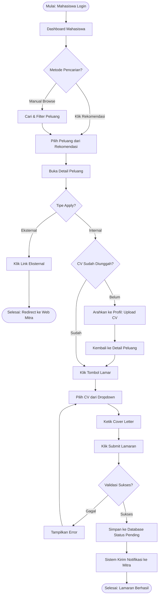
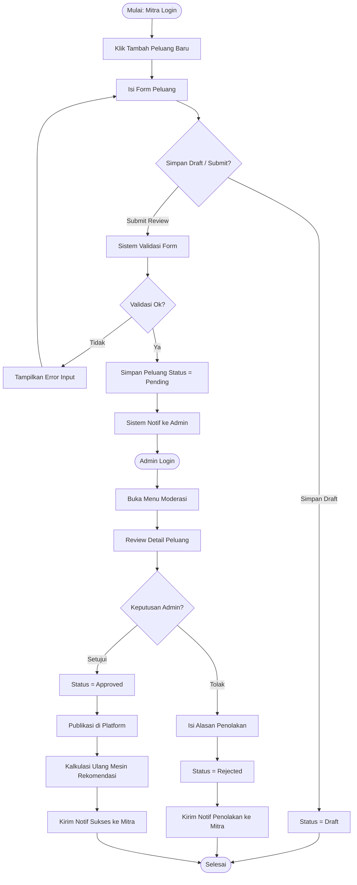

# UI DESIGN SPECIFICATION
## I.R.O.N L.U.N.G
### Intelligent Resource Organizer for Networking, Learning, Unified iNternships, and Group collaboration

| Item | Detail |
|------|--------|
| **Versi** | 1.0.0 |
| **Tanggal** | 06 Mei 2026 |
| **Proyek** | I.R.O.N L.U.N.G |
| **Tim** | Kelompok 6 |
| **Status** | Draft |

---

## 1. DESIGN SYSTEM

### 1.1 Palet Warna Utama & Sekunder
Palet warna dirancang untuk memberikan kesan profesional, modern, dan tepercaya yang cocok untuk platform akademik dan karier.

| Kategori | Warna | Kode Hex | Penggunaan |
|----------|-------|----------|------------|
| **Primary** | Blue 600 | `#2563EB` | Tombol utama, link aktif, header aksen, ikon aktif |
| **Primary Hover**| Blue 700 | `#1D4ED8` | State hover untuk elemen primary |
| **Secondary** | Emerald 500 | `#10B981` | Tombol sukses, badge status (Approved/Accepted) |
| **Accent/Warning**| Amber 500 | `#F59E0B` | Peringatan, badge status (Pending/Menunggu) |
| **Danger** | Red 500 | `#EF4444` | Hapus, badge status (Rejected), pesan error |
| **Background** | Slate 50 | `#F8FAFC` | Warna latar belakang utama aplikasi |
| **Surface** | White | `#FFFFFF` | Latar belakang card, modal, dropdown |
| **Text Primary** | Slate 800 | `#1E293B` | Teks utama (Heading, Body text) |
| **Text Secondary**| Slate 500 | `#64748B` | Teks sekunder (Caption, Placeholder, Meta info) |
| **Border** | Slate 200 | `#E2E8F0` | Garis pemisah, border input, border card |

### 1.2 Tipografi
Mengikuti standar SRS, tipografi utama adalah **Inter** (Google Fonts), sans-serif yang bersih dan sangat baik untuk UI/UX.

| Elemen | Font Family | Weight | Ukuran (Desktop/Mobile) | Line Height |
|--------|-------------|--------|-------------------------|-------------|
| **Heading 1 (H1)** | Inter | Bold (700) | 32px / 24px | 1.2 |
| **Heading 2 (H2)** | Inter | SemiBold (600) | 24px / 20px | 1.3 |
| **Heading 3 (H3)** | Inter | Medium (500) | 20px / 18px | 1.4 |
| **Body Large** | Inter | Regular (400) | 16px / 16px | 1.5 |
| **Body Small** | Inter | Regular (400) | 14px / 14px | 1.5 |
| **Caption/Badge**| Inter | Medium (500) | 12px / 12px | 1.5 |

### 1.3 Grid System & Spacing
- **Sistem Grid**: 12-kolom fluid grid (berbasis Tailwind CSS).
- **Gutter**: 24px (desktop), 16px (mobile).
- **Max-width**: 1280px (container desktop).
- **Spacing Scale (Base 4px)**: 
  - `xs`: 4px
  - `sm`: 8px
  - `md`: 16px
  - `lg`: 24px
  - `xl`: 32px
  - `2xl`: 48px

### 1.4 Komponen UI Standar

- **Button Primary**: Latar `#2563EB`, teks putih, padding 8px 16px, border-radius 6px (md), transisi latar saat hover.
- **Button Secondary**: Latar transparan, border 1px solid `#E2E8F0`, teks `#1E293B`, hover latar `#F1F5F9`.
- **Input Form**: Border `#E2E8F0`, border-radius 6px, padding 8px 12px, teks `#1E293B`. Saat fokus, border menjadi `#2563EB` dan ring 2px.
- **Card**: Latar `#FFFFFF`, border-radius 8px, shadow-sm (`0 1px 2px 0 rgb(0 0 0 / 0.05)`).
- **Badge Status**: 
  - *Pending*: Latar kuning muda, teks `#F59E0B`.
  - *Approved*: Latar hijau muda, teks `#10B981`.
  - *Rejected*: Latar merah muda, teks `#EF4444`.

---

## 2. SITEMAP / NAVIGASI

Hierarki halaman utama dalam aplikasi I.R.O.N L.U.N.G:

```text
IRON LUNG
+-- PUBLIC
|   +-- Landing Page
|   +-- Cari Peluang & Proyek (Mode Read-Only)
|   +-- Login
|   +-- Register
|
+-- DASHBOARD MAHASISWA
|   +-- Beranda (Rekomendasi & Peluang Terbaru)
|   +-- Cari Peluang & Proyek
|   |   +-- Detail Peluang / Proyek
|   +-- Lamaran Saya (Riwayat & Status)
|   +-- Profil & Portofolio
|   |   +-- Kelola CV
|   |   +-- Kelola Minat (Tags)
|
+-- DASHBOARD MITRA INDUSTRI
|   +-- Beranda (Ringkasan & Statistik)
|   +-- Peluang Saya
|   |   +-- Tambah Peluang Baru
|   |   +-- Kelola & Edit Peluang
|   |   +-- Daftar Pelamar (Review & Update Status)
|   +-- Proyek Saya
|   +-- Profil Perusahaan
|
+-- DASHBOARD ADMIN
    +-- Ringkasan Sistem (Statistik Keseluruhan)
    +-- Moderasi Konten
    |   +-- Review Peluang (Approve/Reject)
    |   +-- Review Proyek
    +-- Manajemen Pengguna (Mahasiswa & Mitra)
    +-- Manajemen Master Tag Minat
```

---

## 3. WIREFRAME (5 Halaman Utama)

*Berdasarkan Aturan Mutlak v1.5, wireframe disajikan menggunakan HTML + inline CSS.*

### 3.1. Dashboard Mahasiswa (Beranda & Rekomendasi)
```html
<div style="font-family: sans-serif; color: #1E293B; background: #F8FAFC; min-height: 400px; border: 1px solid #E2E8F0; display: flex; flex-direction: column;">
  <!-- HEADER -->
  <div style="background: #FFFFFF; padding: 16px 24px; border-bottom: 1px solid #E2E8F0; display: flex; justify-content: space-between; align-items: center;">
    <div style="font-weight: bold; color: #2563EB; font-size: 20px;">IRON LUNG</div>
    <div style="display: flex; gap: 16px;">
      <span style="color: #64748B;">🔔</span>
      <span>Halo, Anders (Mhs)</span>
    </div>
  </div>
  
  <div style="display: flex; flex: 1;">
    <!-- SIDEBAR -->
    <div style="width: 200px; background: #FFFFFF; border-right: 1px solid #E2E8F0; padding: 16px;">
      <div style="padding: 8px; background: #F1F5F9; border-radius: 6px; font-weight: bold; color: #2563EB; margin-bottom: 8px;">🏠 Beranda</div>
      <div style="padding: 8px; color: #64748B; margin-bottom: 8px;">🔍 Cari Peluang</div>
      <div style="padding: 8px; color: #64748B; margin-bottom: 8px;">📝 Lamaran Saya</div>
      <div style="padding: 8px; color: #64748B;">👤 Profil</div>
    </div>
    
    <!-- KONTEN UTAMA -->
    <div style="flex: 1; padding: 24px;">
      <h1 style="margin: 0 0 24px 0; font-size: 24px;">Dashboard Mahasiswa</h1>
      
      <h2 style="font-size: 18px; margin-bottom: 16px;">⭐ Direkomendasikan untuk Anda</h2>
      <div style="display: flex; gap: 16px; margin-bottom: 24px;">
        <div style="background: #FFFFFF; padding: 16px; border: 1px solid #E2E8F0; border-radius: 8px; flex: 1;">
          <div style="font-size: 12px; color: #64748B; margin-bottom: 8px;">Magang • PT GoTo</div>
          <h3 style="margin: 0 0 8px 0; font-size: 16px;">Backend Engineer Intern</h3>
          <span style="background: #DBEAFE; color: #1D4ED8; padding: 4px 8px; border-radius: 4px; font-size: 12px;">Web Dev</span>
        </div>
        <div style="background: #FFFFFF; padding: 16px; border: 1px solid #E2E8F0; border-radius: 8px; flex: 1;">
          <div style="font-size: 12px; color: #64748B; margin-bottom: 8px;">Kompetisi • Kemdikbud</div>
          <h3 style="margin: 0 0 8px 0; font-size: 16px;">Gemastik 2026 - UX Design</h3>
          <span style="background: #DBEAFE; color: #1D4ED8; padding: 4px 8px; border-radius: 4px; font-size: 12px;">UI/UX</span>
        </div>
      </div>
      
      <h2 style="font-size: 18px; margin-bottom: 16px;">Peluang Terbaru</h2>
      <div style="background: #FFFFFF; padding: 16px; border: 1px solid #E2E8F0; border-radius: 8px; margin-bottom: 8px;">Data Scientist Intern - Traveloka</div>
      <div style="background: #FFFFFF; padding: 16px; border: 1px solid #E2E8F0; border-radius: 8px;">Frontend Developer Trainee - Tokopedia</div>
    </div>
  </div>
</div>
```

### 3.2. Detail Peluang & Form Apply (Mahasiswa)
```html
<div style="font-family: sans-serif; color: #1E293B; background: #F8FAFC; min-height: 400px; border: 1px solid #E2E8F0; display: flex; flex-direction: column;">
  <!-- HEADER & SIDEBAR DILOMPATI UNTUK FOKUS KONTEN -->
  <div style="background: #FFFFFF; padding: 16px 24px; border-bottom: 1px solid #E2E8F0;">
    <span style="color: #2563EB;">← Kembali ke Pencarian</span>
  </div>
  
  <div style="padding: 24px; max-width: 800px; margin: 0 auto; width: 100%;">
    <div style="background: #FFFFFF; padding: 24px; border: 1px solid #E2E8F0; border-radius: 8px;">
      <h1 style="margin: 0 0 8px 0; font-size: 28px;">Backend Engineer Intern</h1>
      <div style="color: #64748B; margin-bottom: 24px;">PT GoTo • Magang • Deadline: 30 Mei 2026</div>
      
      <h3 style="font-size: 18px; border-bottom: 1px solid #E2E8F0; padding-bottom: 8px; margin-bottom: 16px;">Deskripsi</h3>
      <p style="color: #475569; font-size: 14px; line-height: 1.5; margin-bottom: 24px;">Kami mencari mahasiswa tingkat akhir untuk bergabung dalam tim core backend kami. Anda akan membantu mengembangkan API menggunakan Node.js dan PostgreSQL.</p>
      
      <div style="background: #F8FAFC; padding: 16px; border: 1px solid #E2E8F0; border-radius: 8px;">
        <h3 style="margin: 0 0 16px 0; font-size: 16px;">Form Lamaran Internal</h3>
        <label style="display: block; font-size: 14px; margin-bottom: 8px; font-weight: bold;">Pilih CV</label>
        <select style="width: 100%; padding: 8px; border: 1px solid #E2E8F0; border-radius: 6px; margin-bottom: 16px;">
          <option>CV_Anders_Terbaru_2026.pdf</option>
        </select>
        
        <label style="display: block; font-size: 14px; margin-bottom: 8px; font-weight: bold;">Cover Letter</label>
        <textarea style="width: 100%; padding: 8px; border: 1px solid #E2E8F0; border-radius: 6px; height: 100px; margin-bottom: 16px;" placeholder="Tulis mengapa Anda cocok untuk posisi ini..."></textarea>
        
        <button style="background: #2563EB; color: white; border: none; padding: 10px 24px; border-radius: 6px; font-weight: bold; cursor: pointer;">Kirim Lamaran</button>
      </div>
    </div>
  </div>
</div>
```

### 3.3. Dashboard Mitra Industri (Daftar Peluang)
```html
<div style="font-family: sans-serif; color: #1E293B; background: #F8FAFC; min-height: 400px; border: 1px solid #E2E8F0; display: flex; flex-direction: column;">
  <div style="background: #FFFFFF; padding: 16px 24px; border-bottom: 1px solid #E2E8F0; display: flex; justify-content: space-between; align-items: center;">
    <div style="font-weight: bold; color: #2563EB; font-size: 20px;">IRON LUNG (MITRA)</div>
    <span>PT GoTo</span>
  </div>
  
  <div style="display: flex; flex: 1;">
    <div style="width: 200px; background: #FFFFFF; border-right: 1px solid #E2E8F0; padding: 16px;">
      <div style="padding: 8px; color: #64748B; margin-bottom: 8px;">📊 Beranda</div>
      <div style="padding: 8px; background: #F1F5F9; border-radius: 6px; font-weight: bold; color: #2563EB; margin-bottom: 8px;">💼 Peluang Saya</div>
      <div style="padding: 8px; color: #64748B;">🏢 Profil Perusahaan</div>
    </div>
    
    <div style="flex: 1; padding: 24px;">
      <div style="display: flex; justify-content: space-between; align-items: center; margin-bottom: 24px;">
        <h1 style="margin: 0; font-size: 24px;">Kelola Peluang</h1>
        <button style="background: #2563EB; color: white; border: none; padding: 8px 16px; border-radius: 6px;">+ Tambah Peluang</button>
      </div>
      
      <table style="width: 100%; border-collapse: collapse; background: #FFFFFF; border-radius: 8px; overflow: hidden; border: 1px solid #E2E8F0;">
        <thead style="background: #F8FAFC; border-bottom: 1px solid #E2E8F0; text-align: left;">
          <tr>
            <th style="padding: 12px 16px;">Judul</th>
            <th style="padding: 12px 16px;">Tipe</th>
            <th style="padding: 12px 16px;">Pelamar</th>
            <th style="padding: 12px 16px;">Status</th>
            <th style="padding: 12px 16px;">Aksi</th>
          </tr>
        </thead>
        <tbody>
          <tr style="border-bottom: 1px solid #E2E8F0;">
            <td style="padding: 12px 16px; font-weight: bold;">Backend Intern</td>
            <td style="padding: 12px 16px;">Magang</td>
            <td style="padding: 12px 16px; color: #2563EB; font-weight: bold;">12 Orang</td>
            <td style="padding: 12px 16px;"><span style="background: #D1FAE5; color: #059669; padding: 4px 8px; border-radius: 12px; font-size: 12px;">Approved</span></td>
            <td style="padding: 12px 16px; color: #2563EB;">Lihat Pelamar</td>
          </tr>
          <tr>
            <td style="padding: 12px 16px; font-weight: bold;">Frontend Trainee</td>
            <td style="padding: 12px 16px;">Magang</td>
            <td style="padding: 12px 16px;">0 Orang</td>
            <td style="padding: 12px 16px;"><span style="background: #FEF3C7; color: #D97706; padding: 4px 8px; border-radius: 12px; font-size: 12px;">Pending Review</span></td>
            <td style="padding: 12px 16px; color: #64748B;">Edit | Hapus</td>
          </tr>
        </tbody>
      </table>
    </div>
  </div>
</div>
```

### 3.4. Form Posting Peluang Baru (Mitra Industri)
```html
<div style="font-family: sans-serif; color: #1E293B; background: #F8FAFC; min-height: 400px; border: 1px solid #E2E8F0; display: flex; flex-direction: column;">
  <div style="background: #FFFFFF; padding: 16px 24px; border-bottom: 1px solid #E2E8F0;">
    <span style="color: #2563EB;">← Kembali ke Peluang Saya</span>
  </div>
  
  <div style="padding: 24px; max-width: 600px; margin: 0 auto; width: 100%;">
    <div style="background: #FFFFFF; padding: 24px; border: 1px solid #E2E8F0; border-radius: 8px;">
      <h2 style="margin: 0 0 24px 0;">Buat Peluang Baru</h2>
      
      <label style="display: block; font-size: 14px; margin-bottom: 8px; font-weight: bold;">Judul Peluang *</label>
      <input type="text" style="width: 100%; padding: 8px; border: 1px solid #E2E8F0; border-radius: 6px; margin-bottom: 16px;" placeholder="Contoh: Magang UI/UX Designer">
      
      <div style="display: flex; gap: 16px; margin-bottom: 16px;">
        <div style="flex: 1;">
          <label style="display: block; font-size: 14px; margin-bottom: 8px; font-weight: bold;">Tipe *</label>
          <select style="width: 100%; padding: 8px; border: 1px solid #E2E8F0; border-radius: 6px;">
            <option>Magang</option>
            <option>Kompetisi</option>
            <option>Pelatihan</option>
          </select>
        </div>
        <div style="flex: 1;">
          <label style="display: block; font-size: 14px; margin-bottom: 8px; font-weight: bold;">Deadline *</label>
          <input type="date" style="width: 100%; padding: 8px; border: 1px solid #E2E8F0; border-radius: 6px;">
        </div>
      </div>
      
      <label style="display: block; font-size: 14px; margin-bottom: 8px; font-weight: bold;">Deskripsi *</label>
      <textarea style="width: 100%; padding: 8px; border: 1px solid #E2E8F0; border-radius: 6px; height: 100px; margin-bottom: 24px;"></textarea>
      
      <div style="display: flex; justify-content: flex-end; gap: 16px;">
        <button style="background: #FFFFFF; color: #1E293B; border: 1px solid #E2E8F0; padding: 8px 16px; border-radius: 6px; cursor: pointer;">Simpan Draft</button>
        <button style="background: #2563EB; color: white; border: none; padding: 8px 16px; border-radius: 6px; font-weight: bold; cursor: pointer;">Submit untuk Review</button>
      </div>
    </div>
  </div>
</div>
```

### 3.5. Dashboard Admin (Moderasi Konten)
```html
<div style="font-family: sans-serif; color: #1E293B; background: #F8FAFC; min-height: 400px; border: 1px solid #E2E8F0; display: flex; flex-direction: column;">
  <div style="background: #1E293B; padding: 16px 24px; color: white; display: flex; justify-content: space-between; align-items: center;">
    <div style="font-weight: bold; font-size: 20px;">IRON LUNG ADMIN</div>
    <span>Super Admin</span>
  </div>
  
  <div style="display: flex; flex: 1;">
    <div style="width: 200px; background: #FFFFFF; border-right: 1px solid #E2E8F0; padding: 16px;">
      <div style="padding: 8px; color: #64748B; margin-bottom: 8px;">📈 Statistik</div>
      <div style="padding: 8px; background: #F1F5F9; border-radius: 6px; font-weight: bold; color: #2563EB; margin-bottom: 8px;">🛡️ Moderasi Konten</div>
      <div style="padding: 8px; color: #64748B;">👥 Pengguna</div>
    </div>
    
    <div style="flex: 1; padding: 24px;">
      <h1 style="margin: 0 0 24px 0; font-size: 24px;">Menunggu Review (Pending)</h1>
      
      <div style="background: #FFFFFF; padding: 16px; border: 1px solid #F59E0B; border-radius: 8px; margin-bottom: 16px; border-left: 4px solid #F59E0B;">
        <div style="display: flex; justify-content: space-between; align-items: flex-start;">
          <div>
            <h3 style="margin: 0 0 4px 0;">Frontend Trainee (Magang)</h3>
            <div style="color: #64748B; font-size: 14px; margin-bottom: 12px;">Diajukan oleh: PT Tokopedia • 2 jam yang lalu</div>
            <div style="font-size: 14px; color: #475569; max-width: 600px;">Program pelatihan 3 bulan untuk fresh graduate dan mahasiswa tingkat akhir...</div>
          </div>
          <div style="display: flex; gap: 8px;">
            <button style="background: #EF4444; color: white; border: none; padding: 6px 12px; border-radius: 4px; cursor: pointer;">Tolak</button>
            <button style="background: #10B981; color: white; border: none; padding: 6px 12px; border-radius: 4px; cursor: pointer;">Setujui</button>
          </div>
        </div>
      </div>
      
    </div>
  </div>
</div>
```

---

## 4. UX FLOW (Alur Bisnis Utama)

*Berdasarkan Aturan Mutlak v1.5, diagram UX Flow disajikan menggunakan Mermaid.*

### 4.1. Alur Melamar Peluang (Mahasiswa)


### 4.2. Alur Posting Peluang (Mitra Industri & Admin Approval)


---

## 5. AKSESIBILITAS (WCAG 2.1 AA)

Untuk memastikan platform I.R.O.N L.U.N.G inklusif bagi seluruh pengguna, standar berikut akan diimplementasikan pada level Frontend (Next.js):

1. **Kontras Warna**:
   - Teks utama (`#1E293B`) pada latar putih (`#FFFFFF`) memiliki rasio kontras `14.8:1` (Melewati standar minimum 4.5:1).
   - Teks pada tombol Primary (`#FFFFFF` on `#2563EB`) memiliki rasio kontras `5.1:1` (Melewati).
2. **Navigasi Keyboard**:
   - Seluruh elemen interaktif (`<a>`, `<button>`, `<input>`, `<select>`) wajib dapat diakses menggunakan tombol `Tab`.
   - Mengimplementasikan outline tebal saat elemen mendapat `focus-visible` (ring-blue-500).
   - Fitur "Skip to Main Content" tersedia bagi pengguna screen reader.
3. **Form & Label**:
   - Seluruh `<input>` wajib memiliki `<label>` yang terhubung melalui atribut `for` (di React: `htmlFor`).
   - Placeholder tidak digunakan sebagai pengganti label.
   - Pesan error validasi (contoh: "Email wajib diisi") dibacakan oleh screen reader menggunakan `aria-live="polite"`.
4. **Atribut ARIA**:
   - Penggunaan `aria-hidden="true"` pada elemen dekoratif murni.
   - Penggunaan `aria-expanded` pada dropdown menu dan akordion.

---

## 6. RESPONSIVE DESIGN

Sistem didesain menggunakan pendekatan *Mobile-First*, diadaptasi secara progresif untuk layar lebih besar menggunakan *breakpoints* Tailwind CSS.

### 6.1 Breakpoints

| Device | Ukuran Layar | Prefix Tailwind | Perilaku Layout (Layout Behavior) |
|--------|--------------|-----------------|-----------------------------------|
| **Mobile** | `< 768px` | (default) | Layout 1 kolom vertical. Sidebar dikonversi menjadi Hamburger Menu/Bottom Nav. Tabel kompleks digulir secara horizontal (`overflow-x-auto`) atau diubah menjadi list of cards. |
| **Tablet** | `768px - 1199px`| `md:` | Layout 2 kolom (Sidebar semi-collapsed). Grid disesuaikan menjadi 2 kolom untuk card peluang. |
| **Desktop**| `>= 1200px` | `lg:`, `xl:` | Layout optimal 3 kolom jika diperlukan. Sidebar fixed di kiri, lebar konten maksimal 1280px (tengah). Grid menampilkan 3-4 card peluang per baris. |

### 6.2 Contoh Implementasi Responsif pada Dashboard Mahasiswa
- **Mobile**: Menu diletakkan pada drawer (Hamburger Menu). Seksi "Direkomendasikan" menjadi carousel sentuh horizontal.
- **Tablet**: Sidebar dikecilkan (hanya menampilkan Ikon Menu). Card peluang menggunakan susunan 2x2.
- **Desktop**: Sidebar penuh dengan teks. Card peluang menggunakan susunan berderet secara fleksibel (flex wrap).

---
*Dokumen ini disusun untuk melengkapi tahap perancangan awal perangkat lunak sebelum implementasi kode dilakukan.*
